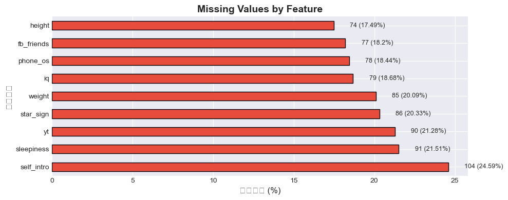

# Training 訓練規劃順序 train.csv
- **EDA**：找出 dataset 的 feature 特性
- **Cleaning**：移除 outliers、無預測能力的欄位
- **Data Split**：train.csv 切分成 train/validation  **(⚠️ 注意：必須在 Imputation 前執行)**
- **Imputation**：填補空缺值 **(⚠️ 注意：僅能使用 train 算出來的統計值填補)**
- **Model Selection**：XGBoost
- **Feature Transformation**：one-hot encoding、scaling
- **Feature Selection**：Filter Methods + Embedded Methods
- **Feature Extraction**(可選擇)：PCA
- **Model Training & Data Balance**：5-fold CV **(⚠️ 注意：若使用 SMOTE，必須在每次 CV 迴圈內部僅針對 Train fold 執行)**
- **Model Evaluation**：Accuracy, F1-Score

# Prediction 規劃順序 test.csv
- **Cleaning**: 同 train.csv 的清理步驟，只是不用移除 outliers
- **Imputation**: 同 train.csv 的填補步驟 **(⚠️ 注意：使用 train.csv 算出的統計值進行填補)**
- **Feature Transformation**: 同 train.csv 的轉換步驟 **(⚠️ 注意：使用 train.csv 算出的參數如 StandardScaler 進行 transform)**
- **Model Prediction**: 使用在 train.csv 上訓練好的模型進行預測
- **Output Mapping**: 將預測結果轉換回原始格式（0→2 for 女生，1→1 for 男生）

## 預測目標： gender (binary classification)
## 特徵需要處理的項目：
- id: 無預測能力的識別碼，直接丟棄
- 數值型特徵（5個）：['height', 'weight', 'sleepiness', 'iq', 'fb_friends']
- 類別型特徵（3個）：['gender','star_sign', 'phone_os']
- text特徵（2個）：['yt', 'self_intro']

### 1. 先不納入計算：
- **id**：無預測能力的識別碼，直接丟棄
- **yt, self_intro**：純文字欄位，且在最簡易版中暫時忽略

### 2. 數值型特徵處理 outliers 與 scaling：
- **height, weight, iq**: 處理 outliers：剪裁 (**Clipping**) 處理極端值，保持常態分佈。
  - Pipeline: 中位數補值 → Clipping (1%-99%) → StandardScaler

- **fb_friends**: 由於有極端值和長尾分佈，需要特殊處理：
  - Pipeline: 中位數補值 → **移除負值 (clip to 0)** → **log(1+x)** 轉換 → StandardScaler
  - ⚠️ **重要**: 數據中存在負值（如 -1000），必須先 clip 到 0，否則 log1p 會產生 NaN

> **Imputation**： height, weight, iq, fb_friends 使用 **中位數** 填補

> **Scaling**： height, weight, iq, fb_friends: 數值特徵使用 **StandardScaler** 進行標準化

### gender: 1 (男), 0 (女) label encoding
> **注意**:
> - 原始數據中 gender: `1`=男, `2`=女
> - 訓練時轉換為: `1`=男, `0`=女（模型內部使用）
> - 預測輸出會轉換回: `1`=男, `2`=女（還原為原始格式）

### 3. 無序類別特徵處理：
- **start_sign**: 雙魚座、牡羊座、金牛座、雙子座、巨蟹座、獅子座、處女座、天秤座、天蠍座、射手座、摩羯座、水瓶座、None
- **phone_os**: Android、iOS、Others
> **Imputation**： start_sign, phone_os 使用 **眾數** 填補

> **Encoding**：進行 **One-Hot Encoding**

### 4. 有序類別特徵處理：
- **sleepiness**: 1,2,3,4,5,None
> **Imputation**：sleepiness 使用 **眾數** 填補。

> **Encoding**：**不做 One-Hot**，直接轉換為數值型特徵 (`float` / `int`)，維持其大小關係。

